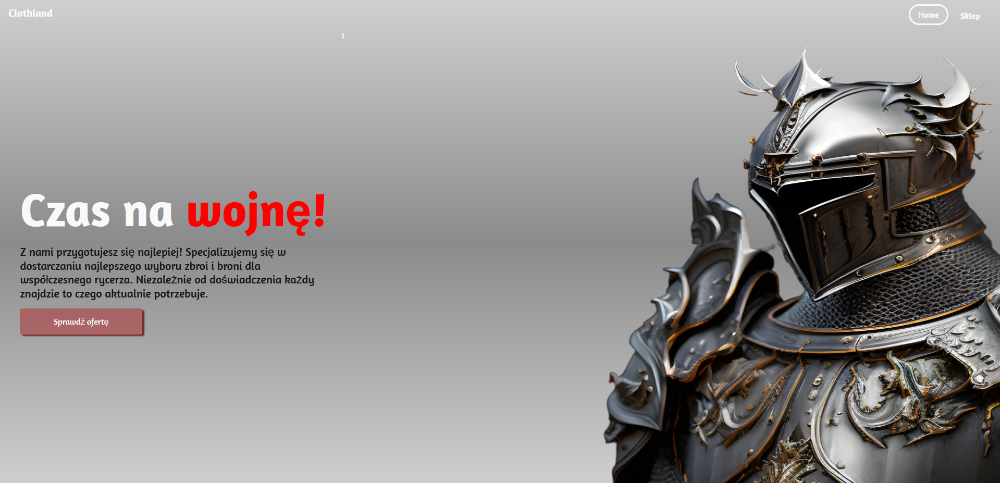
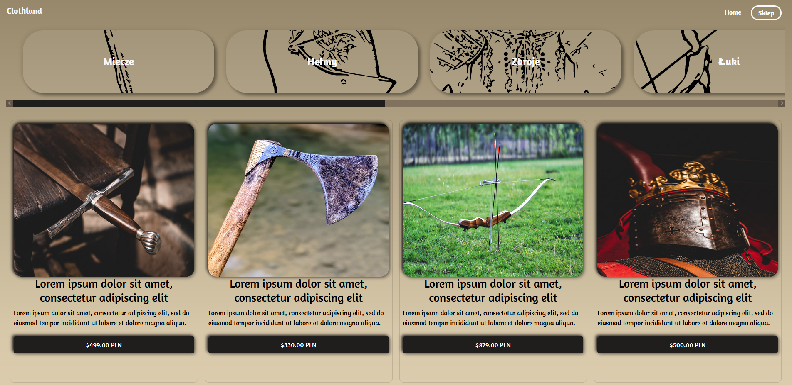

# ClothesSite

This project was generated with [Angular CLI](https://github.com/angular/angular-cli) version 11.1.2.

## Development server

Run `ng serve` for a dev server. Navigate to `http://localhost:4200/`. The app will automatically reload if you change any of the source files.

<h1>This site is for people who likes medieval climate.</h1>

